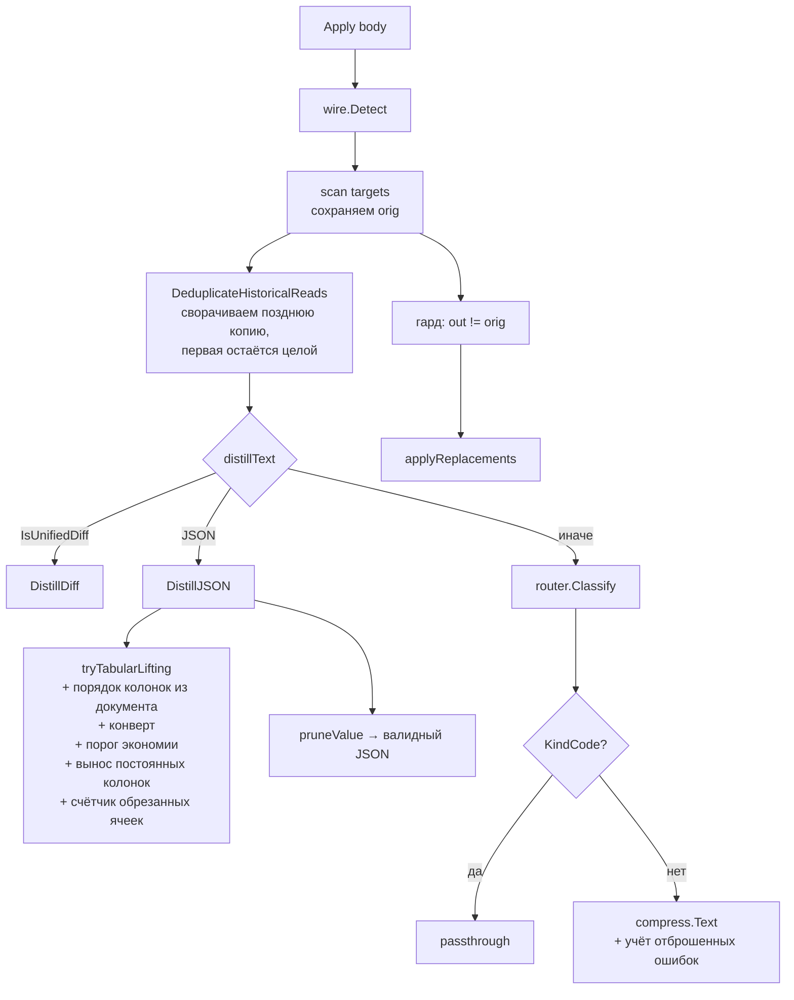

# Design — контракты дистилляции

Status: implemented · Created 2026-09-04 · Updated 2026-09-05

Разделы 2 и 3 переписаны по факту реализации: порядок в `Classify` вышел
обратным задуманному, а порог смены типа перестал отсекать замеренный кейс.
Причины — ниже по месту, помечены «Отклонение».

## Overview

Восемь точечных правок в четырёх пакетах (изначально планировалось пять в трёх;
`distill/dedup.go` и раскрытие обрезки добавились по находкам (g) и (h)). Ни одна не меняет публичный API и ни одна
не добавляет новых проходов по блобу — латентность держим за счёт того, что все
новые проверки работают либо по уже вычисленному префиксу, либо по первому
объекту массива.



Красные места на диаграмме — единственные, где меняется код:
`stream_scanner.go` (orig-гард), `json_tabular.go`
(порядок/конверт/порог/вынос/обрезка), `router.go` (KindCode + паники и
диагностики), `compress.go` (учёт отброшенных), `dedup.go` (направление).

## Компоненты и решения

### 1. `engine/stream_scanner.go` — orig-гард (FR-3)

Проблема: `targets[origIdx].content` перезаписывается результатом дедупа, после
чего гард `out != t.content` сравнивает значение само с собой. Когда
`distillText` возвращает `""` (маркер дедупа короче 64-байтового порога),
fallback ставит `out = t.content` — и гард становится ложным. Замена
выбрасывается, тело сохраняет **исходные** байты, то есть ранний ход
переотправляется целиком.

Решение: разделить «что было в теле» и «что стало после дедупа».

```go
type toolTarget struct {
    turnIndex  int
    startIndex int
    rawLen     int
    content    string // после дедупа; вход для дистилляции
    orig       string // как лежит в теле; база для сравнения
    isUser     bool
}
```

Гард становится `out != t.orig`. Специальный случай
`strings.Contains(t.content, "[... squoze: earlier view")` больше не нужен:
достаточно `if out == "" { out = t.content }`.

Тот же гард применяется в `processAnthropicFast`, где сейчас условие
`out != ""` — оно эмитит замену даже когда байты не изменились (лишняя работа
и лишний инкремент `BlocksSqueezed`).

**Альтернатива (отклонена):** не мутировать `targets[i].content`, а держать
результат дедупа в отдельном слайсе. Эквивалентно по эффекту, но требует
протаскивать индексную карту через обе ветки — больше кода на тот же результат.

### 2. `distill/json_tabular.go` — детерминизм, конверт, порог (FR-1, FR-2)

**Порядок колонок.** `colKeys` собирается итерацией по `map[string]any` —
рандомизировано by design в Go. Минимальный фикс `sort.Strings(colKeys)` даёт
детерминизм, но алфавитный порядок хуже читается моделью (`amount_usd` раньше
`id`). Берём порядок из документа: gjson сохраняет исходный порядок ключей при
`ForEach`, поэтому читаем ключи первого элемента массива по сырой строке.
Fallback — `sort.Strings`, если путь не разобрался. Стоимость: один проход по
первому объекту, не по всему блобу.

**Конверт.** При подъёме массива, лежащего под ключом-обёрткой, скалярные
соседи (`has_more`, `object`, `total`) сейчас теряются. Пишем их в строку
заголовка маркера:

```
[... squoze table: 800 rows · from "data" · has_more=true object=list ...]
```

Порядок соседей — тоже из документа (иначе снова недетерминизм). Берём только
скаляры и только до разумного лимита длины.

**Порог смены типа.** Сейчас таблица принимается при 10% экономии
(`len(tbl) < len(s)*9/10`). Превращение валидного JSON в Markdown — смена типа
данных: любой потребитель, который парсит tool-результат, ломается. Поднимаем
порог до **35%**: если таблица не даёт существенной экономии, падаем в
структурный pruning, который оставляет JSON валидным.

Числа порога держим константами с комментарием, а не магией по коду.

**Отклонение от задуманного.** План гласил: «замеренный кейс (800 строк) экономил
24.4% → теперь останется JSON». Этого не произошло, и правильно, что не
произошло. Вынос постоянных колонок (ниже) поднял экономию того же кейса до
76.2% — он проходит порог по существу, а не в обход. Правило не менялось;
изменилась цифра, которую правило измеряет. Открытый вопрос по грейдингу этого
кейса в харнессе 2papi — в `tasks.md`.

**Вынос постоянных колонок (FR-7, находка (g)).** Колонка с одинаковым значением
во всех строках — самая дорогая вещь в таблице: 800 строк × 62 байта примечания.
Выносим её в заголовок один раз (`· all rows: note=...`) и убираем из таблицы.
Правила, без которых вынос стал бы потерей:

- значение обязано присутствовать и быть не-`nil` **во всех** строках, иначе
  «all rows» — ложь;
- значение, которое `sanitizeCell` пришлось бы обрезать, **не** выносится:
  обрезанная ячейка в теле таблицы покрыта счётчиком обрезки, а обрезанное
  значение в заголовке раскрыть некому (AC-7.3);
- пустые значения и `-` пропускаем — выносить нечего.

Если после выноса не осталось ни одной варьирующейся колонки, таблица не нужна
вовсе: отдаём один заголовок.

**Счётчик обрезанных ячеек (FR-7).** `sanitizeCell` режет на `cellMaxLen = 80`.
Считаем срезы и пишем `N cells truncated` в заголовок — иначе часть «экономии»
на самом деле удаление данных, о котором модель не знает. Когда обрезки нет,
заголовок молчит: иначе пометка превращается в декорацию и перестаёт быть
сигналом.

### 3. `router/router.go` — детектор кода (FR-4)

`KindCode` объявлен, но `Classify` его не возвращает. Доккоммент пакета обещает
«code … NOT mutated» — обещание не выполняется.

**Отклонение от задуманного порядка.** План ставил детектор кода *после*
line-anchored тест-маркеров, рассчитывая, что исходник таких маркеров на началах
строк не имеет. На корпусе это оказалось неверно: генератор фикстур и
golden-файл содержат чужой вывод дословно — это их работа — и набирают проходной
балл тест-гейта. Поэтому код проверяется **до** тест-вывода, а разделяет их не
количество маркеров, а наличие **опенера в нулевой колонке**:

| Шаг | Условие | Результат |
|---|---|---|
| 1 | префикс — валидный JSON | `KindJSON` |
| 2 | `hasCodeOpener(head)` **и** line-anchored маркеров кода ≥2 | `KindCode` |
| 3 | `testScore ≥ 3` = тест-маркеры + `crashHits` + диагностики | `KindTestOutput` |
| 4 | лог-сигналы ≥3 **и** (префикс-метки или ≥3 таймстампа) | `KindLogOutput` |
| 5 | иначе | `KindProse` |

`hasCodeOpener` ищет `package `/`import (`/`func `/`class `/`def `/`#include`/
`export …` и т.п. в нулевой колонке среди первых `codeHeaderLines = 12` непустых
некомментарных строк. Вывод `go test` этого не даёт никогда: его строки идут
либо с отступом, либо с `--- FAIL`/`ok  `/`=== RUN`. Файл же с `package foo` в
первой строке — файл, сколько бы `FAILED` ни лежало в его строковых литералах.
Отступ учитывается для маркеров (`countLineAnchored`), но **не** для опенера — в
этом вся разделяющая сила.

**Паники и вывод компилятора (FR-6, находка (f)).** Побочно выяснилось, что
настоящий машинный вывод этих двух форм в v0.2.0 не сжимался вовсе — уходил в
`KindProse`, потому что слов `FAIL`/`PASS` в нём нет. Добавлены:

- `crashHits` — `panic:`, `goroutine `, `fatal error:`, `Traceback (most recent
  call last)`, `SIGSEGV` и подобные, line-anchored;
- `countDiagnosticLines` — строки вида `path/file.go:12:5: message`
  (`looksLikeDiagnostic`), то есть вывод сборки. Строка с временной меткой в
  начале диагностикой не считается (AC-6.3): это лог, у него свой шаг.

Оба слагаемых входят в `testScore`, так что трасса паники классифицируется как
машинный вывод, даже когда она целиком состоит из строк кода — но только если
опенера в нулевой колонке нет, то есть шаг 2 её не забрал.

Детектор работает по `head` (≤8 КБ, уже вычислен для JSON-проверки) — NFR-1.
Четыре места, где раньше стоял `strings.Split`, заменены на аллокационно-free
итератор `forEachLine`: детектор добавил проходов по строкам, и без этого NFR-1
стоил бы дороже.

**Шаг 1 отсекается по парной скобке (FR-8, находка (i)).** `json.Valid` работает
по `head`, то есть по **усечённому** префиксу, а усечённый JSON невалиден по
определению: любое JSON-тело крупнее `probeLen` уходит в `KindProse`, потратив
перед этим полный разбор 8 КБ и выброшенный `json.SyntaxError` — единственную
аллокацию во всём роутере. Перед разбором добавлена проверка последнего байта:

```go
if trimmed != "" && (trimmed[0] == '{' || trimmed[0] == '[') {
    // Валидный JSON после TrimSpace всегда закрывается скобкой, парной
    // своей первой. Обратное неверно — потому это гард, а не решение.
    last := trimmed[len(trimmed)-1]
    if (trimmed[0] == '{' && last == '}') || (trimmed[0] == '[' && last == ']') {
        if json.Valid([]byte(trimmed)) {
            return KindJSON
        }
    }
}
```

Эквивалентность здесь доказывается, а не замеряется: из `json.Valid(x) == true`
следует, что `x` закрывается парной скобкой, значит гард способен отсечь только
вызовы, которые вернули бы `false`. Ни один вход, ранее дававший `KindJSON`, его
не теряет.

**Почему это не «исправление» находки (i), а только снятие её цены.**
Недостижимость `KindJSON` выше `probeLen` наблюдаемых последствий не имеет: оба
места вызова в `internal/engine` обращаются с `KindJSON` ровно как с
`KindProse`, а Pass 2 `distillText` уже предложил тело `DistillJSON` до того,
как `Classify` вообще запустился. Сделать ветку достижимой значило бы разбирать
JSON целиком на горячем пути ради нуля изменений в выходе — поэтому недостижимость
остаётся, а исчезает лишь напрасная работа.

**Инструментирование (NFR-1).** У пакета не было ни одного бенчмарка, хотя
`Classify` — единственный код, который исполняется для **каждого** блока
инструмента, включая те, что заведомо не будут сжаты. Добавлен
`internal/router/bench_test.go`: по одному кейсу на ветку плюс
`BenchmarkClassifyScaling`, где 270 КБ и 2700 КБ обязаны стоить одинаково —
если крупный кейс начнёт следовать своему размеру, значит полный проход по блобу
куда-то вернулся. Каждый кейс перед замером сверяет фактический `Kind` с
ожидаемым: бенчмарк, незаметно сменивший ветку, продолжал бы печатать число,
измеряя не то — именно этот пин и вскрыл находку (i).

**Альтернатива (отклонена):** поднять порог `testScore` с 3 до, скажем, 8. Это
режет recall на коротком настоящем тест-выводе и не решает проблему принципиально
— файл фикстур всё равно перешагнёт любой порог.

### 4. `compress/compress.go` — раскрытие отброшенных ошибок (FR-5)

`MaxKept=50` молча выбрасывает 51-ю и далее строку с признаком ошибки. Считаем
отброшенные и дописываем в маркер отдельным суффиксом.

Важно: шаблон маркера подставляется через `strings.ReplaceAll(marker, "%d", …)`,
поэтому второй `%d` в шаблоне сломает подстановку. Суффикс формируем отдельно и
дописываем к уже собранному маркеру:

```
[... squoze: 812 middle lines elided · full text kept locally as 0aa46b5acaf8
 · 150 more failure lines dropped, re-read locally ...]
```

Идемпотентность не страдает: гард `strings.Contains(s, markerPrefix)` в начале
`Text` отбивает повторное сжатие независимо от текста маркера.

`MaxKept` не поднимаем: 200 спасённых строк — это токены, за которые платит
пользователь. Честное раскрытие + возможность перечитать локально дешевле.

### 5. `distill/dedup.go` — направление свёртки (FR-3, находка (h))

Гард из §1 доставил замену дедупа до тела — и стало видно, что доставляет он её
не в тот ход. v0.2.0 оставляет целой **последнюю** копию повторно прочитанного
файла и переписывает более ранние. Для промпт-кэша это ровно наоборот: разговор
приходит к провайдеру растущим префиксом, ранние байты уже отправлены и уже
закэшированы, поздние — ещё нет. Правка ранней копии обнуляет кэш с её позиции
до конца запроса; правка поздней не стоит ничего.

Инверсия: целой остаётся **первая** копия, сворачиваются повторы.

```go
out[i] = fmt.Sprintf(
    "[... squoze: identical to the copy in turn %d above (%d bytes) · ref %s ...]",
    first, len(b.Content), b.Ref)
```

Номер в маркере — номер **первого** хода, а не текущего. Это вторая половина
находки: маркер со ссылкой «на ход N назад» переписывался бы на каждом новом
ходе, то есть свёрнутая история не устаканивалась бы никогда и кэш ломался бы
по второму разу — уже не размером, а текстом маркера.

Порог `dedupMinBytes = 512`: сворачивать 200-байтовый повтор в 90-байтовый
маркер — не экономия, а мутация ради мутации, и каждая такая мутация тратит
префикс.

**Альтернатива (отклонена):** оставлять целой самую большую копию независимо от
позиции. Экономит чуть больше байт на редкой раскладке (файл дописали и
перечитали), но снова означает правку уже отправленного — то есть обменивает
контракт на единицы процентов.

## Data model

Новых персистентных структур нет. Изменения полей:

| Структура | Поле | Было | Стало |
|---|---|---|---|
| `engine.toolTarget` | `orig` | — | `string`, база для гарда |
| `distill` (внутр.) | `tabularMinSavings` | 0.10 подразумевалось | 0.35 константа |
| `distill` (внутр.) | `dedupMinBytes` | — | 512, порог свёртки повтора |
| `router` (внутр.) | `codeHeaderLines` | — | 12, окно поиска опенера |
| `router` (внутр.) | `crashHits`, `codeOpeners`, `codeMarkers` | — | таблицы маркеров |

## Error handling

Все новые пути fail-open: если gjson не нашёл массив по пути — падаем на
`sort.Strings`; если детектор кода паникует на коротком блобе — не паникует, все
обращения к строкам через `strings.HasPrefix` без индексации. Существующий
`recover` в `Apply` остаётся последней сеткой (NFR-3).

## Тестовая стратегия

| Требование | Тест | Где |
|---|---|---|
| FR-1 | 12 свежих движков, сравнение заголовка | `2papi/test/squozebench` (`TestJSONTabularDeterminism`) |
| FR-2 | конверт присутствует, выход парсится | `TestJSONEnvelopeLoss` + новый unit в `json_tabular_test.go` |
| FR-3 | 4-турная сессия, message 1 не растёт | `TestDedupReExpandsHistory` |
| FR-4 | `Classify` на коде / на тест-выводе с паникой | новый unit в `router_test.go` + `TestRealRepoFilesAreNotElided` |
| FR-5 | маркер сообщает число отброшенных | новый unit в `compress_test.go` |
| FR-6 | паника и вывод сборки → `KindTestOutput` | `router_test.go` |
| FR-7 | `N cells truncated`, вынос постоянных колонок | `json_contracts_test.go` |
| NFR-1 | p50/p95 до и после | `go run ./test/squozebench` в 2papi |
| NFR-2 | `Apply(Apply(x)) == Apply(x)` | `TestIdempotencyAcrossCorpus` |
| NFR-4 | медиана экономии токенов | `node test/tokenscore.mjs` в 2papi |

Внешний харнесс (15 кейсов, 6 классов) уже существует в 2papi и служит
приёмочным контуром: три его теста — регрессионные пины именно на эти баги, они
должны позеленеть.

## Порядок работ

1. FR-1 + FR-2 (`json_tabular.go`) — независимы.
2. FR-3 (`stream_scanner.go`) — независим.
3. FR-4 (`router.go`) — независим.
4. FR-5 (`compress.go`) — независим.
5. FR-6 (`router.go`) — вместе с п. 3, одна и та же функция.
6. FR-7 (`json_tabular.go`) — вместе с п. 1.
7. FR-3/AC-3.3 (`dedup.go`) — **после** п. 2: пока гард откатывал замену,
   неправильное направление не наблюдалось.
8. Прогон харнесса 2papi через `replace` на локальный squoze, замер латентности
   и токенов, снятие пинов.
