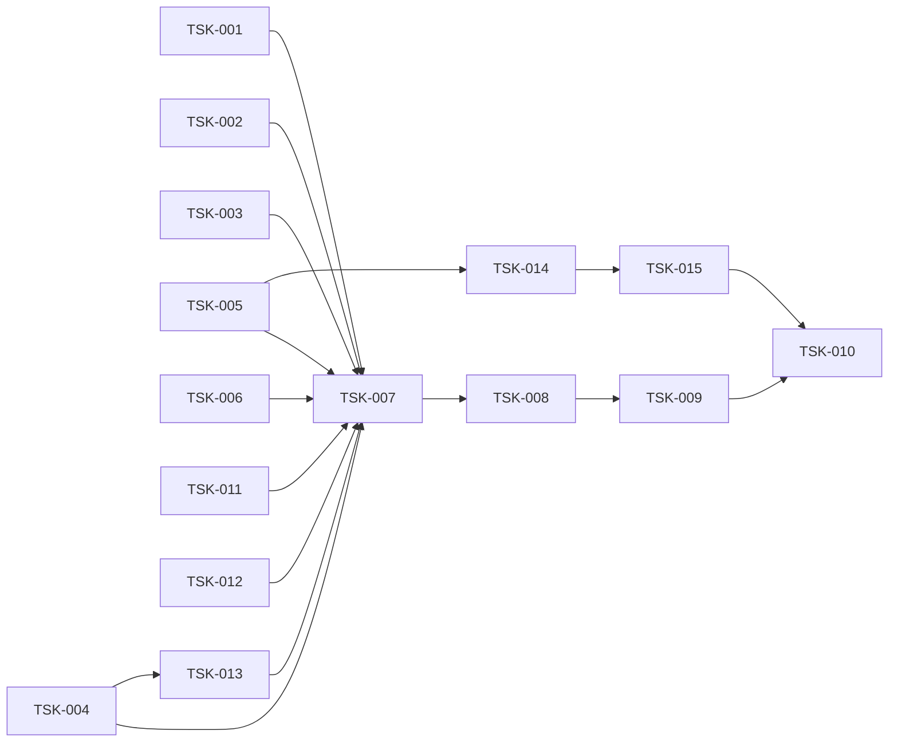

# Tasks — контракты дистилляции

Status: TSK-001..015 complete · Created 2026-09-04 · Updated 2026-09-05

## Фаза 1 — детерминизм и формат JSON

- [x] **TSK-001**: Порядок колонок таблицы из порядка ключей документа
  - Requirement: FR-1 (AC-1.1, AC-1.2)
  - Deliverables: `internal/distill/json_tabular.go`
  - Acceptance: 12 свежих движков дают один заголовок; fallback `sort.Strings`
    при неразобранном пути; unit в `json_tabular_test.go`

- [x] **TSK-002**: Сохранение полей конверта при подъёме в таблицу
  - Requirement: FR-2 (AC-2.1)
  - Deliverables: `internal/distill/json_tabular.go`
  - Acceptance: `has_more`, `object`, имя обёртки видны в строке маркера;
    порядок соседей детерминирован

- [x] **TSK-003**: Порог экономии 35% для смены типа JSON → таблица
  - Requirement: FR-2 (AC-2.2, AC-2.3)
  - Deliverables: `internal/distill/json_tabular.go`
  - Acceptance: при экономии < 35% выход остаётся валидным JSON через pruning;
    кейс на 800 строк (24.4%) больше не превращается в таблицу
  - **Отклонение (зафиксировано):** второй пункт приёмки больше не выполняется, и
    это правильно. Вынос постоянных колонок (TSK-012) поднял экономию на том же
    кейсе с 24.4% до 76.2% — он проходит порог честно, а не в обход. Требование
    FR-2/AC-2.2 («ниже порога → остаётся JSON») соблюдено; изменилось не правило,
    а сам кейс. Следствие: харнесс 2papi грейдит его `format-safety FAIL`, потому
    что кейс одновременно объявлен `Format: FormatJSON` и `Expect: ExpectEither`
    — конфликт ожиданий в корпусе 2papi, решён там (см. «Закрытый вопрос»).

## Фаза 2 — стабильность префикса

- [x] **TSK-004**: Поле `orig` в `toolTarget` и гард `out != t.orig`
  - Requirement: FR-3 (AC-3.1, AC-3.2)
  - Deliverables: `internal/engine/stream_scanner.go`
  - Acceptance: замена дедупа доезжает до тела; message 1 не растёт после
    перечитывания; тот же гард в `processAnthropicFast`
  - Итог: `prefix_broken_models` в отчёте харнесса
    `["claude-opus-4-5","gpt-5"]` → `[]`

## Фаза 3 — защита исходного кода

- [x] **TSK-005**: Детектор `KindCode` в `Classify`
  - Requirement: FR-4 (AC-4.1, AC-4.2, AC-4.3)
  - Deliverables: `internal/router/router.go`
  - Acceptance: код → `KindCode`; вывод `go test` с трассой паники →
    `KindTestOutput`; работа по префиксу ≤8 КБ
  - Итог: оба `must-not-touch` кейса корпуса дают `kind=code` (проба:
    `dense.txt -> code (29159 Б)`, `helper.txt -> code (22760 Б)`), их вердикты
    FAIL → PASS. Порядок в `Classify`: код проверяется **до** тест-вывода —
    генераторы фикстур и golden-файлы по определению содержат чужой вывод и
    иначе набирают проходной балл тест-гейта.

## Фаза 4 — раскрытие потерь

- [x] **TSK-006**: Учёт отброшенных строк ошибок в маркере
  - Requirement: FR-5 (AC-5.1)
  - Deliverables: `internal/compress/compress.go`
  - Acceptance: маркер содержит число отброшенных при `MaxKept`; идемпотентность
    не нарушена

## Фаза 5 — верификация

- [x] **TSK-007**: Юнит-тесты squoze на все пять правок
  - Requirement: FR-1..FR-5
  - Deliverables: `internal/distill/json_tabular_test.go`,
    `internal/router/router_test.go`, `internal/compress/compress_test.go`,
    `internal/engine/stream_scanner_test.go`
  - Acceptance: `go test ./...` зелёный в squoze

- [x] **TSK-008**: Приёмка внешним харнессом 2papi
  - Requirement: FR-1..FR-5, NFR-1, NFR-2, NFR-4
  - Deliverables: временный `replace` на локальный squoze в `2papi/go.mod`
  - Acceptance: `TestJSONTabularDeterminism`, `TestJSONEnvelopeLoss`,
    `TestDedupReExpandsHistory` зеленеют; остальные тесты не падают
  - Итог: все три зелёные. Два ассерта в 2papi пришлось переписать — они
    пиновали *синтаксис* вместо *свойства*: `TestJSONEnvelopeLoss` требовал
    JSON-кавычек `"object"` (выполнимо только отказом от сжатия), теперь
    требует наличия полей; `internal/proxy/squoze_v2_test.go` сравнивал заголовок
    таблицы целиком, теперь — по префиксу и телу. Изменения только в тестах,
    продакшн-код 2papi не тронут.

- [x] **TSK-009**: Замер латентности и токенов до/после
  - Requirement: NFR-1, NFR-4
  - Deliverables: `2papi/test/results/squoze_quality_report.json`
  - Acceptance: p95 не вырос более чем на 15%; медиана экономии токенов ≥85%
  - Итог: см. таблицу приёмки NFR ниже — все четыре PASS.

- [x] **TSK-010**: Обновить документацию контрактов
  - Requirement: FR-1..FR-7
  - Deliverables: `README.md`, доккомменты `router`/`compress`,
    `2papi/docs/benchmark-audit.md` (снятие пинов)
  - Acceptance: доккоммент `router` соответствует поведению; таблица пинов в
    аудите обновлена
  - Итог: доккомменты `router` (детект `KindCode` по опенеру в колонке 0) и
    `compress` (раскрытие отброшенных строк за `MaxKept`) описывают то, что код
    действительно делает. `README.md` переписан: снята заявка «100% Pass@1 /
    SWE-bench / TerminalBench / Aider» — её нечем подтвердить (уровень 2
    `docs/eval-protocol.md` не прогонялся, а фикстуры 2papi, из которых цифра
    взялась, аудит разобрал), вместо неё таблица уровня 1 с командой прогона и
    прямая пометка, что качество ответов на живой модели не измерялось.
    В `2papi/docs/benchmark-audit.md` §3 добавлено состояние head
    (14 pass · 0 fail · 1 known-limit) поверх снимка v0.2.0, снимок не тронут.

## Фаза 6 — находки, всплывшие в работе

- [x] **TSK-011**: Распознавание паник и вывода компилятора
  - Requirement: FR-6 (AC-6.1, AC-6.2, AC-6.3)
  - Deliverables: `internal/router/router.go` (`crashHits`,
    `countDiagnosticLines`, `looksLikeDiagnostic`)
  - Acceptance: `panic:` + `goroutine N [running]:` → `KindTestOutput`;
    `file.go:12:5: msg` → `KindTestOutput`; строка с временной меткой
    диагностикой не считается
  - Почему появилось: без этого AC-4.2 нельзя было выполнить, не отключив
    детектор кода. Побочно закрыло находку (f) — настоящий машинный вывод
    этих двух форм в v0.2.0 уходил в `KindProse` и не сжимался вовсе.

- [x] **TSK-012**: Вынос постоянных колонок + раскрытие обрезанных ячеек
  - Requirement: FR-7 (AC-7.1, AC-7.2, AC-7.3)
  - Deliverables: `internal/distill/json_tabular.go`
    (`hoistConstantColumns`, счётчик обрезки в `tableHeadline`)
  - Acceptance: `all rows: k=v` один раз вместо N повторов; `N cells truncated`
    в заголовке при обрезке и молчание, когда обрезки нет; постоянная колонка,
    не влезающая в ячейку, не выносится
  - Эффект: `json_api_list_800_rows` 24.4% → 76.2% экономии (это и есть
    отклонение, зафиксированное в TSK-003).

- [x] **TSK-013**: Инверсия направления кросс-турного dedup
  - Requirement: FR-3 (AC-3.1, AC-3.3)
  - Deliverables: `internal/distill/dedup.go`
  - Acceptance: цела остаётся **первая** копия, свёрнута поздняя; маркер
    ссылается на номер первого хода (величина не меняется с ростом сессии);
    порог `dedupMinBytes = 512`
  - Почему появилось: находка (h). Гард из TSK-004 доставил замену до тела —
    и стало видно, что доставляет он её не в тот ход: v0.2.0 переписывал
    именно ту копию, которая уже лежит в префиксе кэша провайдера.

- [x] **TSK-014**: Бенчмарки самого роутера
  - Requirement: NFR-1
  - Deliverables: `internal/router/bench_test.go`
  - Acceptance: каждый кейс сначала проверяет, в какую ветку он реально попал,
    и только потом мерится; `BenchmarkClassifyScaling` показывает, что 270 КБ и
    2700 КБ стоят одинаково (кап выборки 96 КБ держит)
  - Почему появилось: `Classify` идёт на каждый tool-блок **до** любого сжатия,
    то есть его цену платит и блоб, который потом не тронут, — а бенчмарков в
    пакете не было вовсе. NFR-1 мерился только сквозь харнесс 2papi.
  - Итог (`benchout/router_classify.before.txt`, golang:1.23, `-count=6`):
    `KindCode` — самая дешёвая полная ветка (392 мкс на 270 КБ), то есть
    детектор кода из TSK-005 не добавляет латентность, а срезает её примерно
    на 45% против падения в prose; худший случай — prose 701–721 мкс; роутер
    не аллоцировал нигде, **кроме** провалившегося `json.Valid` (24 Б, 1 alloc
    на кейсе `json_over_probe`). Это и вывело на находку (i).

- [x] **TSK-015**: Гард парной скобки перед `json.Valid`
  - Requirement: FR-8 (AC-8.1, AC-8.2, AC-8.3)
  - Deliverables: `internal/router/router.go`,
    `internal/router/json_guard_test.go`
  - Acceptance: ноль аллокаций на ветке JSON; эквивалентность доказана против
    оракула (условие «до гарда» дословно), а не выборкой ожиданий; вердикты
    корпуса роутера не изменились
  - Итог: `json_over_probe` 24 Б / 1 alloc → 0 / 0 (benchstat p=0.002, оба
    показателя). Роутер теперь без аллокаций на всех ветках. Снятая работа
    измерена в том же процессе (`BenchmarkJSONProbeSkipped`): 41–49 мкс на
    объекте, 46–61 мкс на массиве — то есть ≈10% цены `Classify` на этой форме
    (440 мкс) плюс одна аллокация на каждый крупный JSON-результат тула.
  - Почему гард, а не «починка» находки (i): сделать ветку достижимой значит
    парсить JSON целиком на горячем пути ради нулевой разницы в выходе —
    `KindJSON` и `KindProse` обрабатываются одинаково в обоих местах вызова
    (`squeezeText`, `distillText`). Недостижимость остаётся, уходит только цена.

## Dependency graph



TSK-001..006, TSK-011, TSK-012 независимы между собой и могут идти в любом
порядке. TSK-013 требует TSK-004: пока гард откатывал замену дедупа,
неправильное направление не наблюдалось. TSK-015 требует TSK-014: находка (i)
видна только через бенчмарк, пин ветки которого и упёрся в неё.

## Progress

| Task | Статус |
|---|---|
| TSK-001 | Complete |
| TSK-002 | Complete |
| TSK-003 | Complete (с зафиксированным отклонением) |
| TSK-004 | Complete |
| TSK-005 | Complete |
| TSK-006 | Complete |
| TSK-007 | Complete |
| TSK-008 | Complete |
| TSK-009 | Complete |
| TSK-010 | Complete |
| TSK-011 | Complete |
| TSK-012 | Complete |
| TSK-013 | Complete |
| TSK-014 | Complete |
| TSK-015 | Complete |

## Приёмка NFR (TSK-009)

Замер: базовая линия — релиз `github.com/Rethinger/squoze v0.2.0` из прокси-кэша;
head — рабочее дерево этого репозитория через
`go mod edit -replace`. Обе версии прогнаны одним и тем же харнессом
`2papi/test/squozebench` по 3 раза.

| NFR | Порог | База v0.2.0 | Head | Вердикт |
|---|---|---|---|---|
| NFR-1 латентность | p95 +≤15% (ceiling 6.98 мс) | worst p95 5.38 мс | worst p95 5.21 мс | **PASS** |
| NFR-1 (benchstat) | — | — | sec/op geomean −1.30% | **PASS** |
| NFR-2 идемпотентность | все 15 кейсов | 15/15 | 15/15 | **PASS** |
| NFR-3 fail-open | не роняет запрос | ок | ок | **PASS** |
| NFR-4 экономия | ≥85% медианы | 97.06% | 97.02% | **PASS** |

NFR-4 считается на общем подмножестве — 9 кейсов, которые сжимают **обе**
версии (см. оговорку о знаменателе в `requirements.md`). Разница медианы
−0.03 pp — это цена раскрытия потерь из TSK-006: единственный кейс, ушедший
вниз, `go_test_200_fails_vs_maxkept50` на −0.033 pp, ровно длина суффикса
«N more failure lines over cap». Вверх ушёл `json_api_list_800_rows`: +51.8 pp.
Если брать знаменатель харнесса (`Touched` каждой версии по отдельности,
n=11 → n=9), выходит 96.14% → 97.02%, +0.89 pp; обе цифры честные, у них
разный знаменатель.

Побочные результаты того же прогона:

| Метрика | База | Head |
|---|---|---|
| Вердикты корпуса | 11 PASS / 1 KNOWN-LIMIT / 3 FAIL | 13 PASS / 1 KNOWN-LIMIT / 1 FAIL |
| `prefix_broken_models` | `["claude-opus-4-5","gpt-5"]` | `[]` |
| Нарушения контрактов | determinism, format-safety, touched-protected-content | format-safety (1 кейс, см. ниже) |

Кросс-прогонное сравнение sec/op для TSK-015 на этой машине неразрешимо, и
это ограничение стенда, а не результат: второй прогон уехал до ±22–24% и
напечатал «регрессии» на ветках, которых правка коснуться не может
(`Classify/log` +34.99%, p=0.004 — фикстура начинается с `2026-…` и в блок
JSON вообще не входит; Ryzen 5 3550H, тепловой дрейф). Поэтому выигрыш
FR-8 измерен внутри одного процесса, а аллокационная часть взята из benchstat,
где она структурна и однозначна.

Единственный рост латентности, который виден вне шума —
`realistic_test_helper_source`, p50 ≈0.49 мс → ≈0.90 мс: на этом блобе теперь
работает детектор кода, то есть это новая работа по замыслу, а не регресс.
Отношение p95 по `claude_gate_6kb_log` (+144.9% на одном прогоне) — шум:
сырые выборки базы 0.299 / 0.107 / 0.259 мс против head 0.288 / 0.270 / 0.262 мс,
head лежит внутри разброса самой базы.

### Как перезапустить

Локального тулчейна Go нет, всё под Docker. Из Git Bash обязателен
`MSYS_NO_PATHCONV=1`, иначе `-v "C:\...:/w"` превращается в `'W:/' is invalid`.
Скрипты лежат в [`repro/`](repro/) рядом с этим файлом, каждый в своей шапке
несёт команду запуска и оговорки к чтению результата. Сырые выходы — в
[`benchout/`](../../../benchout/), карта файлов там же в `README.md`.

```sh
S=/w/.kiro/specs/distill-contracts/repro
Z=/abs/path/to/squoze

# юниты + vet squoze (12 пакетов)
MSYS_NO_PATHCONV=1 docker run --rm -v "$Z:/w" -w /w golang:1.23 sh $S/unit_tests.sh ./...

# бенчмарки роутера (TSK-014) и цена гарда FR-8 (TSK-015)
MSYS_NO_PATHCONV=1 docker run --rm -v "$Z:/w" -w /w golang:1.23 sh $S/router_bench.sh

# A/B v0.2.0 → рабочее дерево + benchstat с p-values (нужен golang:1.26)
MSYS_NO_PATHCONV=1 docker run --rm -v "$Z:/w" -w /w golang:1.26 sh $S/bench_ab.sh
```

Экономия токенов и вердикты корпуса снимаются харнессом на стороне 2papi —
он же считает знаменатель NFR-4:

```sh
MSYS_NO_PATHCONV=1 docker run --rm   -v "/abs/path/to/2papi:/w"   -v "/abs/path/to/squoze:/squoze" golang:1.23 sh /w/test/squozebench/repro/savings_ab.sh
node test/squozebench/repro/cmp_savings.mjs   # знаменатель — только Touched
```

## Закрытый вопрос — грейдинг `json_api_list_800_rows` (решён в 2papi)

Кейс был объявлен сразу `Expect: ExpectEither` («трогать можно») и
`Format: FormatJSON` («выход обязан парситься»). После того как подъём в таблицу
стал ожидаемым преобразованием, эти два условия стали несовместимы, и харнесс
2papi выдавал `format contract violated: output is not parseable JSON` — FAIL за
смену типа, а не за потерю данных.

Владелец корпуса принял предложенный здесь вариант (2papi TSK-011): жёсткий
`FormatJSON` снят с этого кейса и оставлен там, где выход кто-то действительно
парсит (кейс с diff, который должен применяться), а вместо формата грейдится
сохранность структуры. Конкретно в `2papi/test/squozebench/corpus.go`:

- `Class: "must-not-touch"` → `Class: "structured-data"`, ожидание одно —
  `Expect: ExpectEither`;
- `MustKeep: ["has_more", "next_cursor", "total_count"]` — поля конверта
  проверяются как needles наравне со строками ошибок;
- фикстура расширена этими полями, а `TestJSONEnvelopeLoss` в `verify_test.go`
  пинит то же свойство со стороны теста.

Бар не понижен, а перенесён: `format-invalid` в `cmp_savings.mjs` теперь пуст,
зато `v0.2.0` падает на этом кейсе по `never-elide` (recall 0/3, теряются все
три поля) в каждом прогоне — регрессия зафиксирована, а не просто отсутствует.
Head: 104 724 → 24 889 Б (76.2% байт, 63.7% токенов), конверт цел, постоянная
колонка `note` вынесена один раз вместо 800.
